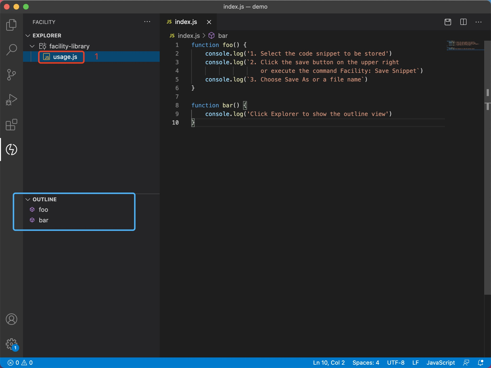
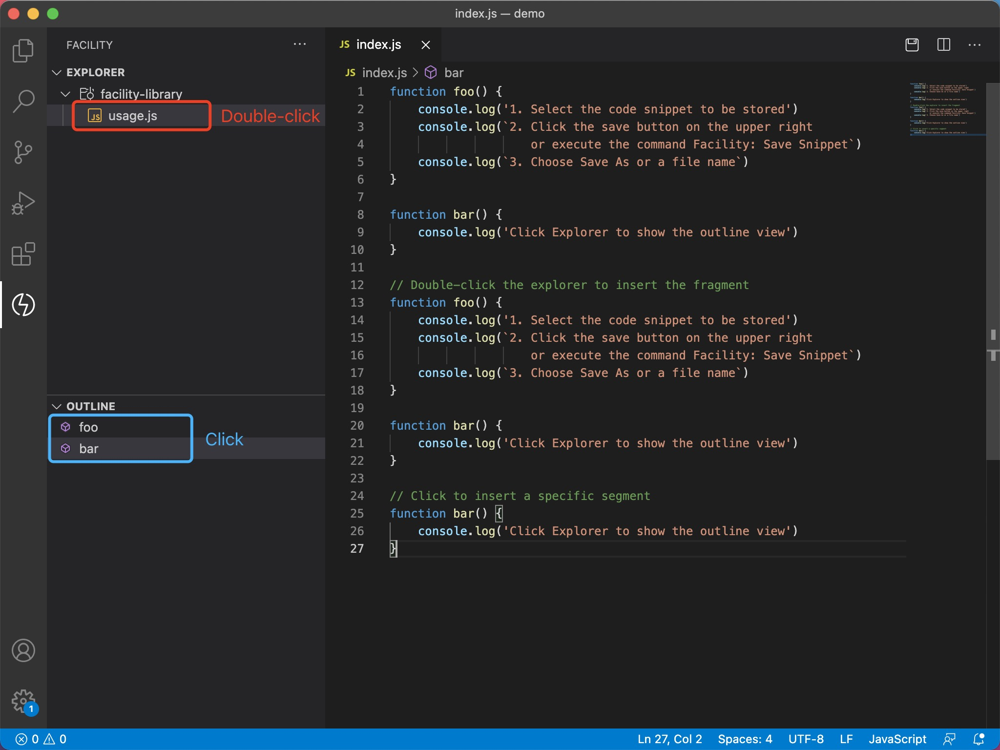
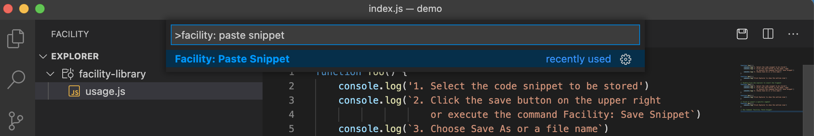
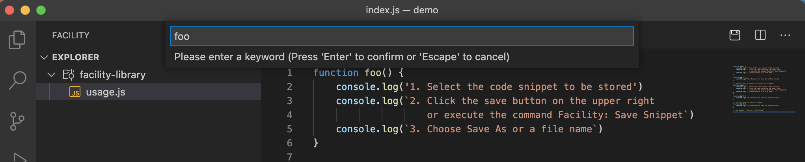
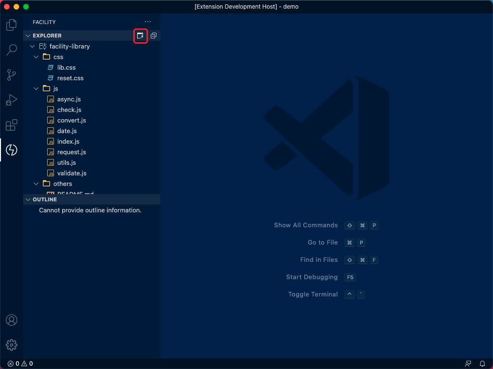

English | [简体中文](./README.zh-CN.md)

<h1 align="center">
   
    
    
  Facility
   
   
</h1>

  

    <a
      href="https://marketplace.visualstudio.com/items?itemName=sillyy.facility"
      ></a
    >&nbsp;
    <a
      href="https://marketplace.visualstudio.com/items?itemName=sillyy.facility"
      ></a
    >&nbsp;
    
  

## Quick Start

- Click "Shop Icon" on Activity Bar of VS Code

- Enter "facility" in the input box to search

- Click the Install button on the first facility option

  

After installation is successful, click the "Facility icon" on Activity Bar of VS Code to start:

## **Features**

### Visual operation

Operate code snippet visually

### New Snippet

1. Select the code snippet to be stored

2. Press `⇧⌘P` (MacOS) or `Ctrl+Shift+P` (Windows), input `Facility: Save Snippet` to open the selector panel

   Or : 

   Click the save icon on the right side of the tab bar to open the selector panel

3. Choose Save As or a file name and save to the local repository

### Show function outline

1. Open the Explorer
2. Click Explorer to show the outline view

### Insert Snippet

#### Visualize inserts

1. Place the input anchor at the specified position

2. Double-click 「Explorer」 to insert all the contents of the file

   Or :  

   Click「Outline」 to insert the specified function Snippet

#### Imperative insert

##### Configure keywords

1. Press `⇧⌘P` (MacOS) or `Ctrl+Shift+P` (Windows), input `Preferences: Open Settings (json)` to open the configuration panel
2. Configure `facility.keyword` in the form of 「keyword-path」

##### Paste Snippet

1. Use `⇧⌘P` (MacOS) or `Ctrl+Shift+P` (Windows) to call up the command panel, enter `Facility: Paste Fragment` to open the keyword input panel
2. Enter keywords and press Enter to confirm

### Open Repository

Use `⇧⌘P` (MacOS) or `Ctrl + Shift + P` (Windows) to call up the command panel, enter `Facility: Open Repository` to open the Repository window

   Or :  

Click「Open Repository」 to open the Repository window

## FAQ

Sometimes I click the "Explorer" tree list, why doesn't the outline appear

The interface for obtaining the outline list is provided by VSCode, and the API call can only be used after the VSCode core module is loaded.
 
It is recommended to restart the application or click several times to manually trigger the VSCode core module loading

## License

[MIT](LICENSE)

