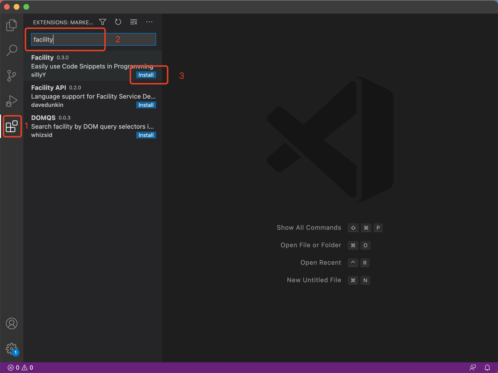
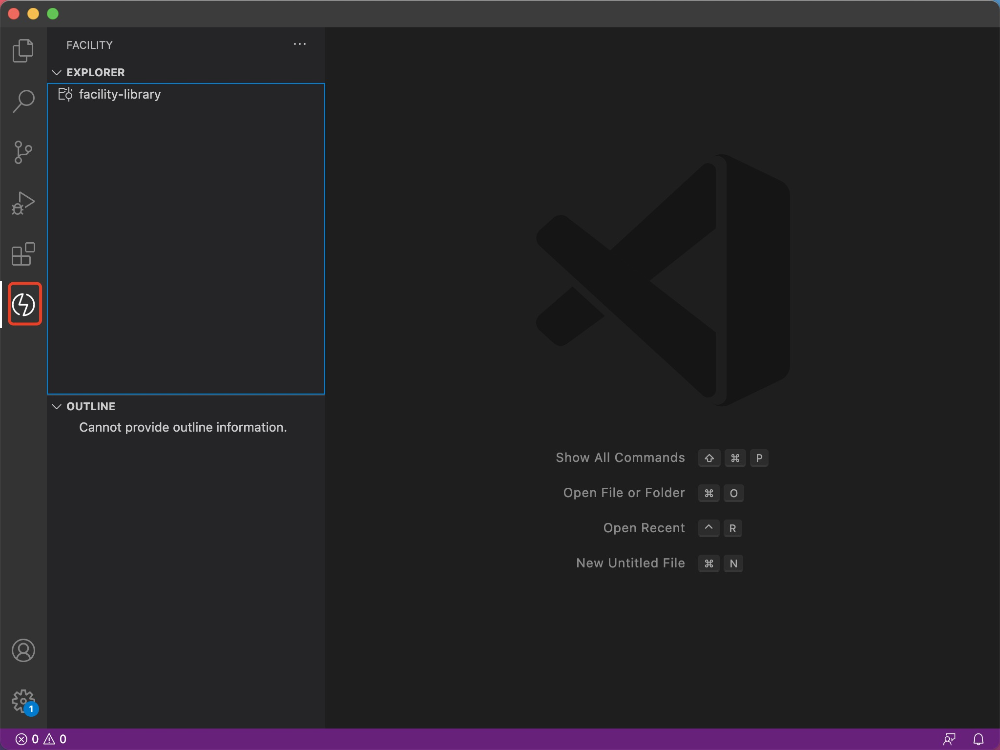
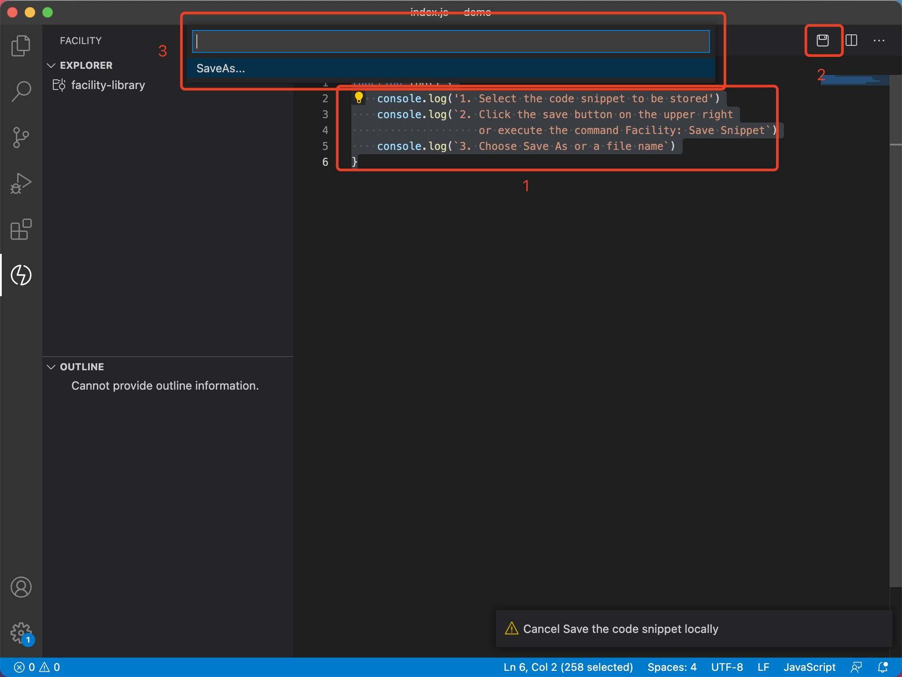
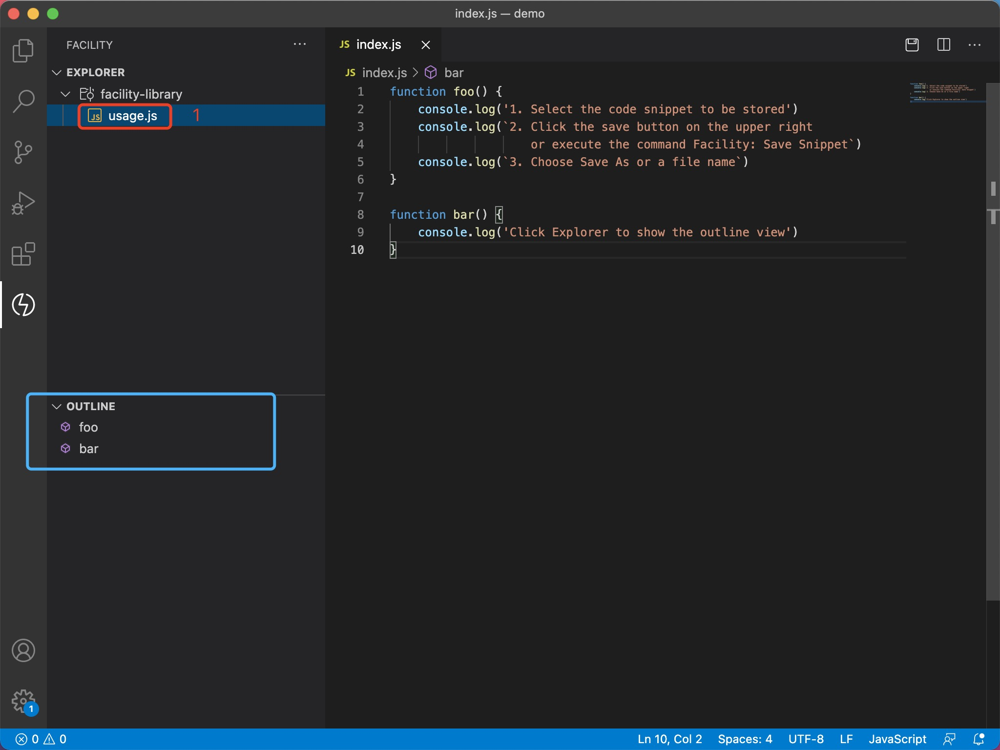
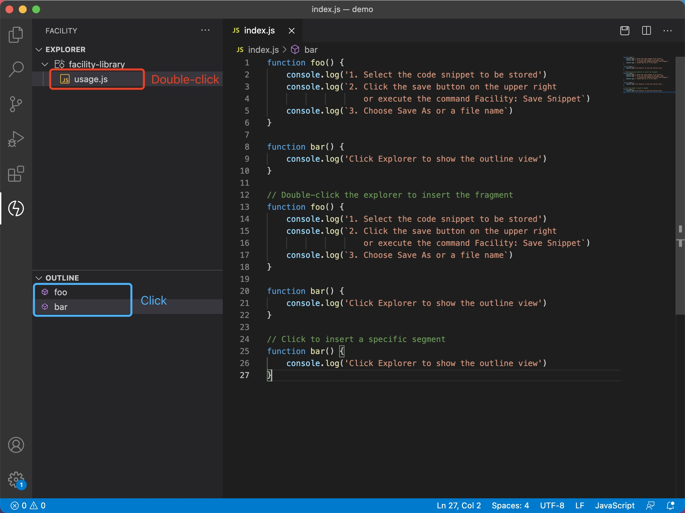
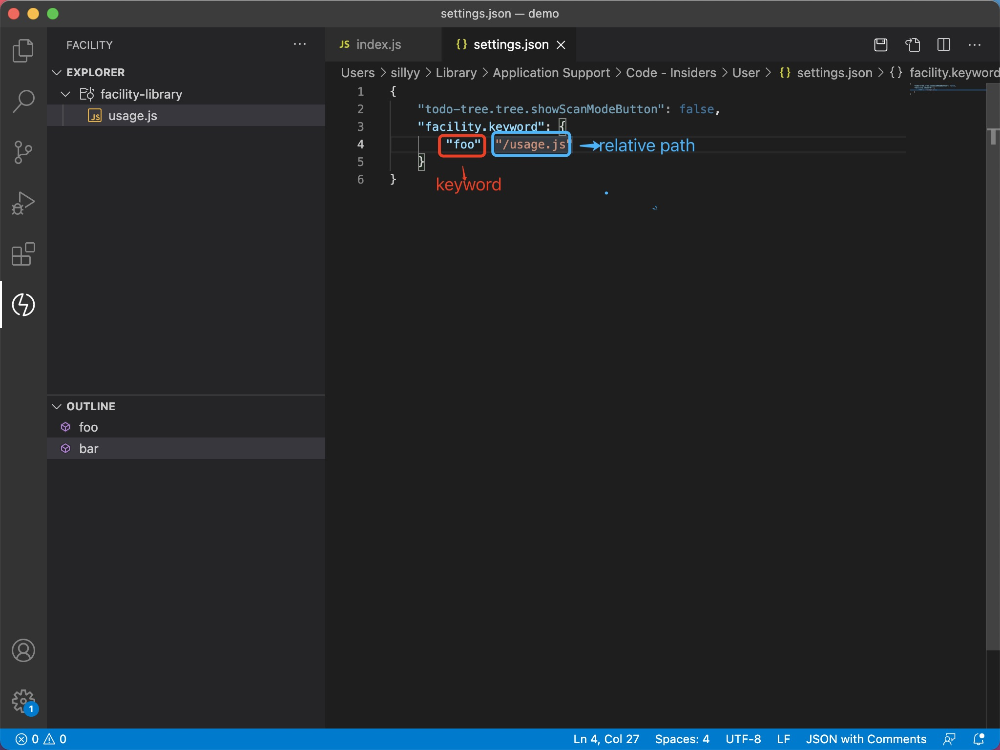
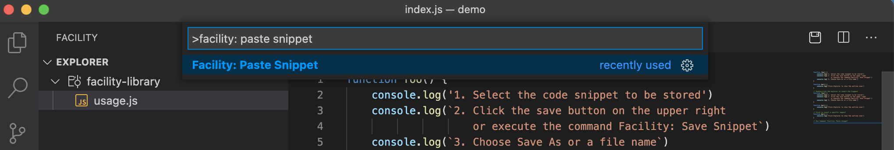
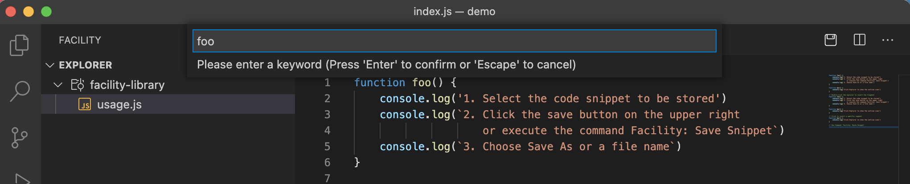
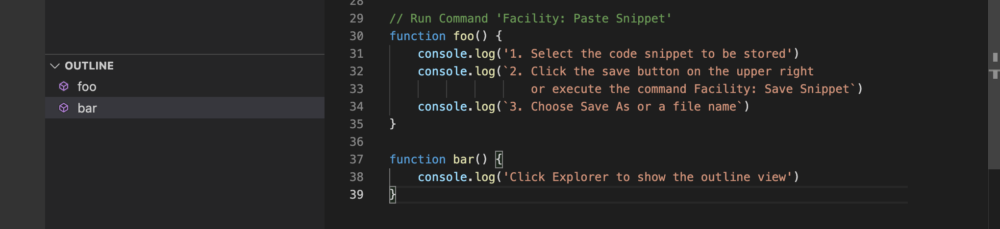
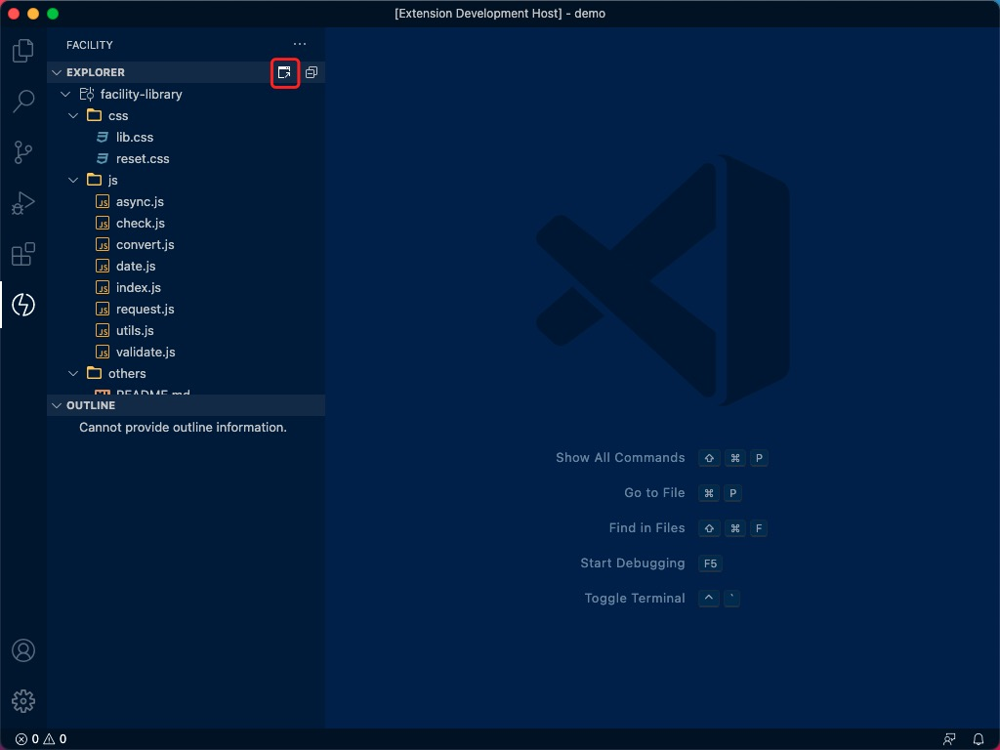

简体中文 | [English](./README.md)

<h1 align="center">
   
    
    
  Facility
   
   
</h1>

  

    <a
      href="https://marketplace.visualstudio.com/items?itemName=sillyy.facility"
      ></a
    >&nbsp;
    <a
      href="https://marketplace.visualstudio.com/items?itemName=sillyy.facility"
      ></a
    >&nbsp;
    
  

## **快速开始**

- 点击 VS Code 活动栏上的「插件商店图标」；

- 在输入框中输入「facility」进行搜索；

- 点击第一个「facility」选项上的「安装」按钮。

  

安装成功后，点击 VS Code 界面左侧活动栏上的「Facility 图标」，开始使用：

## **核心特性**

### 可视化操作

通过可视化的方式对代码片段进行操作

### 新建片段

1. 选中需要保存的snippets

2. 通过 ⇧⌘P ( MacOS ) 或 Ctrl+Shift+P ( Windows ) 快捷键唤起命令面板，输入 `Facility: 保存片段` ，打开选择器面板

   或者：

   点击标签栏右侧的保存图标，打开选择器面板

3. 选择另存为或某个文件名，保存到本地仓库

### 显示函数大纲

1. 打开资源管理器树形列表
2. 单击列表项，显示函数大纲列表

### 插入片段

#### 可视化插入片段

1. 输入锚点放置于指定位置

2. 双击「资源管理器」树形列表 「列表项」，插入列表文件全部内容

   或者 ：

   点击「大纲」树形列表 「列表项」，插入指定函数片段

#### 命令式插入片段

##### 配置关键词

1. 通过 ⇧⌘P ( MacOS ) 或 Ctrl+Shift+P ( Windows ) 快捷键唤起命令面板，输入 `首选项: 打开设置(json)` ，打开配置面版
2. 以 「关键字-路径」的形式，配置 `facility.keyword`

##### 插入片段

1. 通过 ⇧⌘P ( MacOS ) 或 Ctrl+Shift+P ( Windows ) 快捷键唤起命令面板，输入 `Facility: 粘贴片段` ，打开关键字输入面板
2. 输入关键字，并按 Enter 确认

### 打开仓库

通过 ⇧⌘P ( MacOS ) 或 Ctrl+Shift+P ( Windows ) 快捷键唤起命令面板，输入 `Facility: 打开仓库`, 打开仓库资源管理器窗口

   或者 :  

点击「打开仓库」 图标，打开仓库资源管理器窗口

## 常见问题

有时点击「资源管理器」树形列表，为什么不显示「大纲」树形列表

用于获取大纲列表的接口由 VSCode 提供的，API调用需等 VSCode 核心模块加载完成后，方能使用。
 
建议重启应用或者多点击几次，手动触发VSCode 核心模块加载

## License

[MIT](LICENSE)

